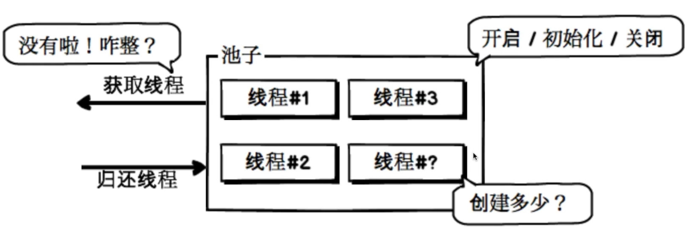
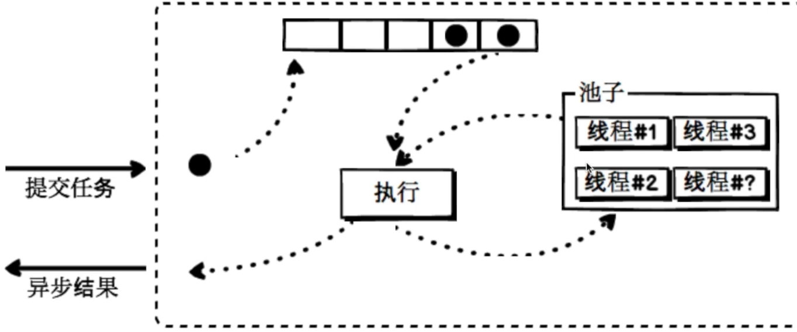
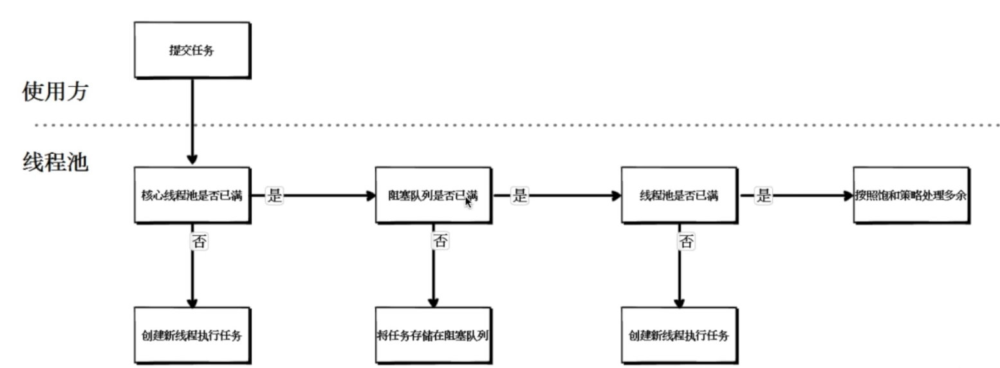
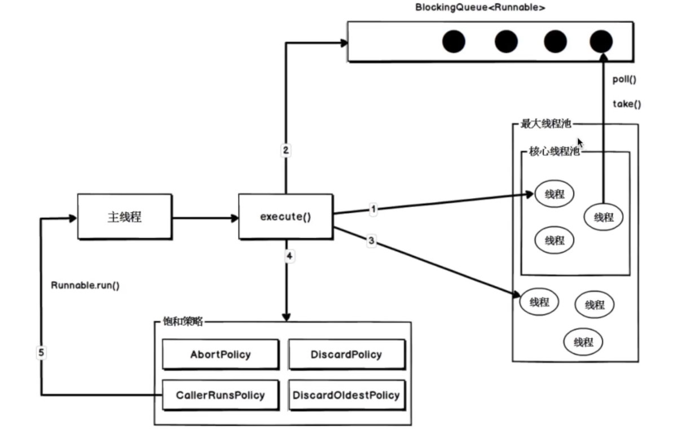
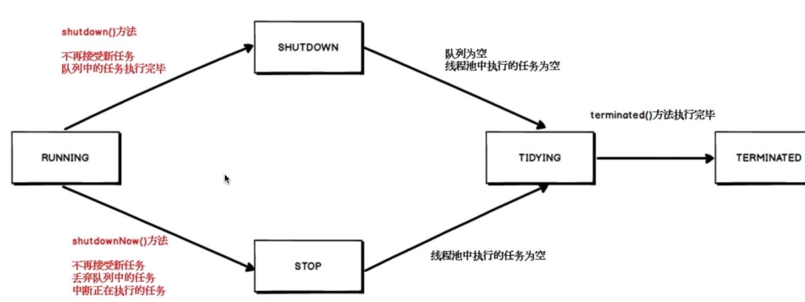

# Escape 996 

## 1. Java 原生技术
### 1.1 函数式编程
函数式编程书籍: 
> Java 8 实战
> Java 8 函数式编程

#### 1.1.1 函数式接口

- 接口中只有一个抽象方法
- Java 8 中的函数式接口注解: `@FunctionInterface`,只是标注不是要求强制实现
- 函数式接口的抽象方法签名: 函数描述符

#### 1.1.2 自定义函数式接口

#### 1.1.3 系统函数式接口
- `java.util.function` 包下的函数式接口
- 使用 `int` 类型的函数式接口不会**拆箱装箱**(省性能)

#### 1.1.4 方法引用
调用特定方法的 `lambda` 表达式的一种快捷方式,可以让你重复使用现有的方法定义,像 `lambda` 表达式一样传递他们.

- 指向静态方法的方法引用 
- 指向任意实例方法的方法引用
- 指向现有对象的实例方法的方法引用

### 1.2 流
> 从支持数据处理操作的源生成元素序列。

流和集合的区别：
1. 集合面向的存储
2. 流面向的计算
3. 流只能遍历一次
4. 外部迭代(集合)，内部迭代(流)

#### 1.2.1 流的组成
数据源+**中间操作**+**终端操作**

#### 1.2.2 流操作的分类
中间操作:
 1. 无状态: `filter/map/peek`
 2. 有状态: `distinct/sorted/limit`

终端操作:
1. 非短路操作: `foreach/collect/count` 等
2. 短路操作: `anyMatch/findFirst/findAny` 等

#### 1.2.3 流的使用
| 中间操作(无状态) | 中间操作(有状态) | 终端操作(短路)      | 终端操作(非短路) |
| ---------------- | ---------------- | ------------------- | ---------------- |
| 过滤 (filter)    | 去重(distinct)   | 所有匹配(allMatch)  | 遍历(forEach)    |
| 映射(map)        | 跳过(skip)       | 任意匹配(anyMatch)  | 归约(reduce)     |
| 扁平化(flatMap)  | 截断(limit)      | 不匹配(noneMatch)   | 最大值(max)      |
| 遍历(peek)       | 排序(sort)       | 查找首个(findFirst) | 聚合(collect)    |
| -                | -                | 查找任意(findAny)   | 最小值(min)      |
| -                | -                | -                   | 计数(count)      |

举例: 分页

```java
    /**
     * skip the first n number
     * <p>
     * limit 取前几条数据
     * <p>
     * 两个结合可以进行<b>分页</b>
     */
    @Test
    public void skipTest() {
        list.stream().
                sorted(Comparator.comparing(Sku::getTotalPrice))
                // 第 2 页, 每页 2 条
                .skip(1 * 2)
                .skip(2)
                .forEach(this::printJson);
    }
```

#### 1.2.4 流的构建

1. 由值创建流

    ```java
    Stream<Integer> stream = Stream.of(1, 2, 34, 9, 52, 7);
    ```

2. 由数组创建流

    ```java
    int[] arr = {1, 2, 34, 5, 56,};
    IntStream arrStream = Arrays.stream(arr);
    ```

3. 由文件创建流

    ```java
    Stream<String> lineStream = Files.lines(Paths.get("filepath"));
    ```

4. 由函数生成流(无限流  )

    ```java
    Stream<Integer> iterate = Stream.iterate(0, n -> n + 1).limit(100L);
    Stream<Double> generate = Stream.generate(Math::random).limit(100L);
    ```

#### 1.2.5 收集器(`Collectors 类`)

- 将流中的元素累计成一个结果
- 作用域终端操作 `collect()`上
- `collect/Collector/Collectors`

**预定义收集器**

1. 将流元素归约和汇总为一个值

    ```java
    Collectors.toList() // toList
    ```

2. 将流元素进行分组

    ```java
    // 分组条件,结果集合
    Map<Enum, List<Sku>> enumListMap = list.stream().collect(Collectors.groupingBy(Sku::getSkuCategory));
    ```

3. 将流元素分区(按照某一条件进行分区),分区知识分组的一个特例

    ```java
    Map<Boolean, List<Sku>> map = list.stream().collect(Collectors.partitioningBy(sku -> sku.getTotalPrice() > 200));
    ```

### 1.3 资源关闭 @since: JDK1.7 

#### 1.3.1 垃圾回收♻️的特点

- 垃圾回收只负责回收堆内存的资源,**不回收任何物理资源**
- 程序无法**精确控制**垃圾回收动作的具体资源
- 垃圾回收之前,总是先调用他的 finalize 方法

#### 1.3.2 常见需要手动释放的物理资源

- 文件/流资源
- 套接字资源
- 数据库连接资源
- NIO 的直接内存资源


不释放物理资源的后果

- 资源被长时间无效占用
- 超过最大资源后,将无资源可用
- 程序最后无法运行

#### 1.3.3 文件拷贝

JDK 之前的代码 **关闭的时候先打开的后关闭**

```java
@Test
public void copyFile() {
    // file in/out put stream
    FileInputStream originStream = null;
    FileOutputStream fileOutputStream = null;
    File file;
    try {
        originStream = new FileInputStream(originUrl);
        fileOutputStream = new FileOutputStream(targetUrl);
        int content;
        // iterator and read/out put byte
        while ((content = originStream.read()) != -1) {
            fileOutputStream.write(content);
        }
    } catch (IOException e) {
        e.printStackTrace();
    } finally {
        if (fileOutputStream != null) {
            try {
                fileOutputStream.close();
            } catch (IOException e) {
                e.printStackTrace();
            }
        }
        if (originStream != null) {
            try {
                originStream.close();
            } catch (IOException e) {
                e.printStackTrace();
            }
        }
    }
}
```

JDK 7 后 `try-with-resourse` 语法糖

```java
@Test
public void copyFileNewTest() {
    try (
            FileInputStream inputStream = new FileInputStream(originUrl);
            FileOutputStream outputStream = new FileOutputStream(targetUrl);
    ) {
        int content;
        // iterator and read/out put byte
        while ((content = inputStream.read()) != -1) {
            outputStream.write(content);
        }
    } catch (IOException e) {
        e.printStackTrace();
    }
}
```

#### 1.3.4 `try-with-resource` 方法内部的原理

- 反编译后也是原来的方法
- 多资源自动关闭
- 实现`AutoCloseable`方法
- 不会产生异常屏蔽

#### 1.3.5 资源关闭的特殊方法

- 资源对象被 return 的情况下,由调用方关闭

- `ByteArrayInputStream`等情况不需要检查关闭的资源对象
- 由 Socket 获取的 InputStream 和 OutPutStream 对象不需要关闭, 只需要 Socket 的`shutdownInput` 方法,**这样仅仅会关闭输入流,不会关闭Socket链接🔗**

### 1.4 线程池

**线程池**就是事先创建若干个可以执行的线程放入一个容器中,需要的时候从线程中获取线程,使用完成后放入线程池中,而不是销毁. 从而减少创建和销毁线程对象的开销.


**线程池的好处**

1. 减少资源的消耗(数据库连接也是)
2. 提高响应速度
3. 提高线程的可管理性

#### 1.4.1 🍋🍋🍋简单线程池设计

**简单线程的设计:**

1. 首先需要一个池子,具有初始化/开启/关闭的的功能.

2. 可以获取线程
3. 可以归还线程

需要考虑的问题:

1. 创建多少个线程?
2. 池中没有了线程怎么办?




**综合性能好的线程池**: 使用者只需要提交任务,让线程池对任务进行处理, 然后异步返回结果就行了.




1. 使用者提交任务,传入任务对列
2. 执行器从对列中拿到任务,用线程池中的线程进行执行
3. 执行之后异步返回结果,然后将线程归还到线程池中

需要考虑的问题:

1. 线程池中的创建个数
2. 线程对列需要多长?
3. 线程对列满了怎么办?

#### 1.4.2 线程池的核心参数

```java
    /**
     * @param corePoolSize 核心线程数量
     * @param maximumPoolSize 最大线程数量
     * @param keepAliveTime 线程空闲后的的存活时间
     * @param unit 时间单位
     * @param workQueue 用于存放任务的阻塞队列
     * @param threadFactory 线程工厂类
     * @param handler 当队列和最大线程池都满了后的策略
     */
    public ThreadPoolExecutor(int corePoolSize,
                              int maximumPoolSize,
                              long keepAliveTime,
                              TimeUnit unit,
                              BlockingQueue<Runnable> workQueue,
                              ThreadFactory threadFactory,
                              RejectedExecutionHandler handler) {
        this(corePoolSize, maximumPoolSize, keepAliveTime, unit, workQueue,
             Executors.defaultThreadFactory(), handler);
    }
```

#### 1.4.3 线程池的处理流程



#### 1.4.4 可选择的线程池的阻塞队列

> 阻塞队列:就是支持两个附加操作(阻塞的插入和移出的方法)的队列
>
> - 无界对列,无限长
> - 有界队列
> - 同步移交队列,不存入队列的阻塞队列,每一个插入操作必须要等待另一个线程去移出操作

JDK 提供的阻塞队列

##### 1.4.4.1 提供的阻塞队列 3 种

- **ArrayBlockingQueue 有界队列**,当添加元素到达容量的时候会产生阻塞
- **LinkedBlockingDeque 可以有界/也可以无界**基于链表的实现, 当添加元素到达容量的时候会产生阻塞,默认为`this(Integer.MAX_VALUE);`.
-  **SynchronousQueue**, 同步移交队列,插入的时候依托于某一个线程.不存储元素

#### 1.4.5线程池的饱和策略 4 种

- **AbortPolicy 终止策略(默认)**: 调用返回异常 `throw new RejectedExecutionException`

- **DiscardPolicy 抛弃策略**: 调用什么都没有执行,进行抛弃

- **DiscardOlderstPolicy抛弃旧的任务策略**

    ```java
    public void rejectedExecution(Runnable r, ThreadPoolExecutor e) {
      	// 判断线程池是否 shutDown 了
        if (!e.isShutdown()) {
          	// 删除一个元素
          	e.getQueue().poll();
    				// 在执行线程
          	e.execute(r);
         }
    }
    ```

- **CallerRunsPolicy调用者运行策略**

    ```java
    public void rejectedExecution(Runnable r, ThreadPoolExecutor e) {
        if (!e.isShutdown()) {
            r.run(); // 不是 start 方法,而是 run 方法,调用方自己执行这个任务,调用方就会自己阻塞
        }
    }
    ```

    

#### 1.4.6 线程池的执行示意图




1. 主线程调用`execute()`方法
2. 如果核心线程池没有满(1),就立刻创建一个线程来执行这个任务
3. 如果满了就将任务提交到阻塞队列中(2),核心线程会不断地确阻塞队列中拉取线程
4. 核心线程和阻塞队列都已经满了就创建新的线程(3),**前提是核心线程池的线程数量没有超过最大线程数**,此时会创建新的线程来执行任务.
5. 如果线程数已经超过了最大线程数.就会执行第4 步,调用饱和策略进行处理. 如果调用的是掉用者运行策略(5),就会返回到主线程,让主线程去运行.

#### 1.4.7 常用线程池

##### 1.4.7.1 newCachedThreadPool 线程池无限的线程池

**有一个任务,就要有一个线程去消费**.才能接受另一个任务.容易创建无限个线程.从而达到程序崩溃.

```java
public static ExecutorService newCachedThreadPool() {
  // 核心线程池为 0, 最大线程池为 Integer 的最大值,阻塞队列为:同步移交的阻塞队列
        return new ThreadPoolExecutor(0, Integer.MAX_VALUE,
                                      60L, TimeUnit.SECONDS,
                                      new SynchronousQueue<Runnable>());
}
```

##### 1.4.7.2 newFixedThreadPool 线程池无限的线程池

线程数量**固定**的线程池, 使用无界队列.虽然线程数量固定,但是**是无界队列**,过多队列容易将程序造成崩溃.

```java
public static ExecutorService newFixedThreadPool(int nThreads) {
        return new ThreadPoolExecutor(nThreads, nThreads,
                                      0L, TimeUnit.MILLISECONDS,
                                      new LinkedBlockingQueue<Runnable>());
}
```

##### 1.4.7.3 newFixedThreadPool 线程池无限的线程池

单一线程的线程池

```java
public static ExecutorService newSingleThreadExecutor() {
    return new FinalizableDelegatedExecutorService
        (new ThreadPoolExecutor(1, 1,
                                0L, TimeUnit.MILLISECONDS,
                                new LinkedBlockingQueue<Runnable>()));
}
```

#### 1.4.8 向线程池中提交任务

##### 1.4.8.1 使用 `submit()`方法

 返回 `Future` 对象, 调用 `get()` 方法得到值,`get()`方法是一个阻塞方法. `submit()`传入的是一个`Callable()`方法,可以抛出异常

```java
@Test
public void submitTest() throws ExecutionException, InterruptedException {
    // create a thread pool
    ExecutorService cachedThreadPool = Executors.newCachedThreadPool();
    // use submit submit a task,
    Future<Integer> future = cachedThreadPool.submit(() -> {
        Thread.sleep(TimeUnit.SECONDS.toSeconds(1));
        return 2 * 5;
    });
    // future.get() is a blocking method, until the method is done
    Integer integer = future.get();
    Utils.printJson(integer);
}
```

##### 1.4.8.2 使用`execute()`提交任务

**没有返回结果**,传入的是`Runnable()`方法, 不可以抛出异常.

```java
@Test
public void executorTest() {
    ExecutorService fixedThreadPool = Executors.newFixedThreadPool(10);
    // no return result and will not throw any exception, cause input is a Runnable interface
    fixedThreadPool.execute(() -> {
        try {
            Thread.sleep(TimeUnit.SECONDS.toSeconds(2));
        } catch (InterruptedException e) {
            e.printStackTrace();
        }
        int num = 2 * 5;
        System.out.println("执行结果:" + num);
    });

}
```

#### 1.4.9 线程池的状态

- **RUNNING**: 线程池处在正常的运行状态中能接收任务,能把任务添加到阻塞队列中,
    - 当调用`shutDown()`方法的时候,不接受新的任务,会将对列中的任务执行完毕,之后进入 **SHUTDOWN** 状态
    - 当调用`shutDownNow()`方法,不再接收新的任务,丢弃队列中的方法,中断正在执行的任务,之后进去 **STOP**方法
- **SHUTDOWN**:  后队列为空,执行任务为空. 进入到 **TIDYING** 状态
- **STOP**: 线程池中的执行任务为空进入到, 进入到 **TIDYING** 状态
- **TERMINATED** 线程池内部调用`terminated()`方法后进入到该状态

需要注意的是 `shutDownNow()`和`shutDown()`方法,主要的区别是: **是否丢弃队列中的方法**




## 2. 优秀开源框架

### 2.1 guava

Google 中集合、缓存、原生类型支持、并发库、通用注解、字符串处理、I/O等。

#### 2.1.1 避免使用 null, java 8 中的 Optional

Guava 引入 `Optional<T>`表示可能为 `null` 的 `T` 类型引用。可能包括引用存在和引用缺失。

##### 2.1.1.1 创建 optional的 3 种方法

- `Optional<Object> o = Optional.empty();`
- `Optional<Integer> integer = Optional.of(1);` 不接受`null`
- `Optional<Object> optional = Optional.ofNullable(null);` 可以接受 null 值

##### 2.1.1.5 Optional 的使用方式

1. 判断是否引用消失,建议不使用 `optional.isPresent();`
2. 如果存在: `optional.ifPresent(System.out::println);`,类似的方法,`map`,`filter` `flatMap`

3. 当 option 引用丢失的时候执行 `optional.orElseGet(() -> { return "else"; });`
4. 当应用丢失的时候抛出异常: `optional.orElseThrow(() -> { throw new RuntimeException("引用缺失"); });`

#### 2.1.2  Guava 不可变集合

创建对象的**不可变拷贝**是一项很好的**防御性编程**技巧.

Guava 为所有的 JDK 标准集合类型个 Guava 新集合类型都提供了简单易用的不可变版本集合.

##### 2.1.2.1 不可变对象额优点

- 当对象被不可信库调用的时候,不可变形式是安全
- 不可变对象被多个线程调用时,不存在**竞态**条件问题
- 不可变集合不需要考虑变换,因此可以节省时间和空间
- 不可变对象因为有固定不变,可以作为常量来安全使用

JDK 虽然提供了`unmodifiableXXX`方法但是有很多确点

- 笨重而且累赘
- 不安全
- 低效

使用 jdk 中的不可变 list 方法, 麻烦而且会下面的方法会抛出异常: `Exception in thread "main" java.lang.UnsupportedOperationException`

```java
 public static void removeOneElement(List<Integer> list) {
     list.remove(0);
 }
 public static void main(String[] args) {
     ArrayList<Integer> list = new ArrayList<>();
     list.add(1);
     list.add(2);
     list.add(3);
     List<Integer> newList = Collections.unmodifiableList(list);
     removeOneElement(newList);
     System.out.println(list);
 }
```

##### 2.1.2.2 不可变结合的创建方式

- copyOf:  `ImmutableSet<Integer> set = ImmutableSet.copyOf(list);`

- of : `ImmutableList<ArrayList<Integer>> immutableList = ImmutableList.of(list);`

- Builder 方法

    ```java
     ImmutableList<Object> build = ImmutableList.builder()
                    .add(1)
                    .addAll(Sets.newHashSet(234, 34))
                    .add(4).build();
    ```


#### 2.1.3 新集合类型

Guava 中引入了很多 JDK 没有的、但是很有用的新集合类型。这些类型是为了和 JDK 集合框架共存，而没有往 JDK 集合抽象中硬塞其他概念。

##### 2.1.3.1 🍏Multiset(无序可以重复的数据类型)

- 可以看成没有元素顺序限制的 `ArrayList(E)`,包含的方法
    - `add(E)`添加单个元素
    - `iterator()` 返回一个迭代器,包含全部的元素
    - `size()` 返回全部的元素的总个数(包含重复元素)
- 也可以看成 `Map<E,Integer>` 键为元素,值为计数
    - `Count(Object)` 返回给定元素的计数
    - `entrySet()` 返回 `Set<Multiset,Entry<E>>` 和 Map 中的`entrySet`类似
    - `elementSet()` 返回所有不重复元素的`Set<E>`和 Map 中的`keySet`类似

Multiset 和 map 的区别

- 元素计数只能为正数
- `multise.size()`返回的是集合大小
- `multiset.iterator() ` 会迭代重复元素
- Multiset 可以直接设置元素的计数
- 对于没有的元素, `multiset.count(E)`为 0

多种 Multiset 的实现

- HashMultiset
- TreeMultiset
- LinkedHashMultiset
- ConcurrentHashMultiset
- ImmutableMultiset


#### 2.1.4 Guava 集合工具类

Guava 提供了许多工具方法,常见的集合工具类有 Lists,Maps,Sets.

##### 2.1.4.1 Sets/Lists 工具类

Sets 常用的方法: 

- **并集**(union)
- **交集**(intersection)
- **差集**(differece) 不同之处,注意传入参数的位置
- **相对差集**, 属于 A 且不属于 B 或者属于 B 不属于 A 的元素
- **分解集合中的所有自己子集** :`powerSet(E)`
- **求两个集合的笛卡尔积**``cartesianProduct()`

Lists 常用方法: 

- **反转**: `Lists.reverse(list)`

- **拆分/**:`Lists.partition(list, 2);`


#### 2.1.5 Guava IO 工具类方方法

##### 2.1.5.1 IO 工具方法

- `ByteStreams`: 提供对`InputStream/OutputStream `方法的操作
- `CharStreams`:提供对`Readr/Writer`的操作

##### 2.1.5.2 对源(Source)和汇(Sink)的抽象

- 源是可读的: `ByteSource/CharSource`
- 汇是可写的`ByteSink/CharSink`

使用 Guava 文件拷贝

```java
public void cpyFile() throws IOException {
        // 1. create Source and Sink
        CharSource charSource = Files.asCharSource(new File(""), Charsets.UTF_8);
        CharSink charSink = Files.asCharSink(new File(""), Charsets.UTF_8);
        // 2. copy file
        charSource.copyTo(charSink);
    }
```

`Files`其他方法:

- 读取行
- 读取行并且进行操作
- 进行写入

### 2.2 验证框架


## 开发常用工具

